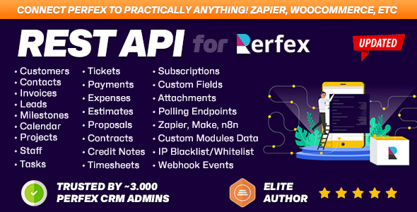

<p>
  <a href="https://themesic.com/product/rest-api-module-for-perfex-crm-connect-your-perfex-crm-with-third-party-applications/">
    
  </a>
</p>

# Perfex CRM REST API — Esempi, Postman Collection e Snippet di Codice

[English](README.md) · [简体中文](README.zh-CN.md) · [Español](README.es.md) · [Português (BR)](README.pt-BR.md) · 🌐 **Italiano** · [Français](README.fr.md) · [Deutsch](README.de.md) · [Türkçe](README.tr.md) · [Tiếng Việt](README.vi.md) · [ไทย](README.th.md) · [العربية](README.ar.md)

> **Postman collection** pronta all'uso, **snippet di codice** (cURL, PHP, Python, JavaScript) e un
> **catalogo** delle risorse per il [modulo REST API per Perfex CRM](https://themesic.com/product/rest-api-module-for-perfex-crm-connect-your-perfex-crm-with-third-party-applications/) —
> il modo più rapido per **collegare Perfex CRM con agenti AI e applicazioni di terze parti**.

[](postman/perfex-rest-api.postman_collection.json)
[](https://perfexcrm.themesic.com/apiguide/)
[](LICENSE)
[](https://themesic.com/product/rest-api-module-for-perfex-crm-connect-your-perfex-crm-with-third-party-applications/)

La **REST API di Perfex CRM** ti permette di leggere e scrivere clienti, lead, fatture, preventivi, progetti,
attività e altro tramite una pulita interfaccia HTTP/JSON — perfetta per l'**integrazione CRM**, l'automazione e le app
personalizzate. La **v3.0** aggiunge un **server MCP per agenti AI**, **webhook** di livello produzione, polling pronto
all'uso per **Zapier / Make / n8n**, operazioni **batch** ed endpoint di elenco più intelligenti. Questo repository è il
complemento pratico del modulo
**[REST API for Perfex CRM](https://themesic.com/product/rest-api-module-for-perfex-crm-connect-your-perfex-crm-with-third-party-applications/)**
di **Themesic Interactive**: esempi da copiare e incollare, una Postman collection importabile e un catalogo completo
degli endpoint.

- 🧩 **Ottieni il modulo:** https://themesic.com/product/rest-api-module-for-perfex-crm-connect-your-perfex-crm-with-third-party-applications/
- 📖 **Guida API / documentazione live:** https://perfexcrm.themesic.com/apiguide/
- 🧾 **Specifica OpenAPI 3.0:** `GET https://yourdomain.com/api/openapi`

---

## 🚀 Novità della v3.0

| Funzionalità | Endpoint | Cosa fa |
| --- | --- | --- |
| 🤖 **Server MCP** | `POST /api/mcp` | Model Context Protocol (JSON-RPC 2.0) — espone **148 strumenti CRM filtrati per permessi** a Claude Desktop, ChatGPT, Cursor, n8n AI Agent e qualsiasi client MCP |
| 🪝 **Webhooks 2.0** | `/api/webhooks` | **124 eventi**, gestione REST, consegna asincrona con retry, protezione SSRF, richieste **firmate HMAC** |
| 🔌 **Automazione (polling)** | `/api/zapier/*` | Trigger di polling pronti all'uso per **Zapier, Make.com, n8n** e qualsiasi strumento basato su polling |
| ⚡ **Batch** | `POST /api/batch` | Fino a **50 operazioni** in una singola richiesta (stessi nomi di strumenti di MCP) |
| 📚 **Knowledge Base** | `/api/knowledge_base` | CRUD di articoli + gruppi |
| 🗒️ **Note** | `/api/notes` | Note polimorfiche su 12 tipi di entità |
| 📄 **Elenchi più intelligenti** | qualsiasi endpoint di elenco | Opzionali `?page=&per_page=`, `?fields=`, `?sort=`, `?created_after=&created_before=` |
| 🛡️ **Scritture sicure** | qualsiasi `POST` | Replay tramite `Idempotency-Key`, campi sconosciuti ignorati su `PUT`, header `X-RateLimit-*` |

> Tutto è **opzionale** e retrocompatibile: le richieste senza i nuovi parametri restituiscono esattamente la
> stessa risposta di prima.

---

## Contenuti

| Cartella | Cosa contiene |
| --- | --- |
| [`postman/`](postman/) | **Collection** + **environment** Postman importabili (`{{base_url}}`, `{{authtoken}}`) — ora con MCP, Webhooks, Batch, Automazione, Knowledge Base e Note |
| [`snippets/curl/`](snippets/curl/) | Comandi `curl` da copiare e incollare per le chiamate più comuni |
| [`snippets/php/`](snippets/php/) | Esempi PHP (cURL) |
| [`snippets/python/`](snippets/python/) | Esempi Python (`requests`) |
| [`snippets/javascript/`](snippets/javascript/) | Esempi JavaScript / Node (`fetch`) |
| [`docs/`](docs/) | Autenticazione, paginazione e filtraggio, webhook, MCP, automazione, errori e codici di stato |

Ogni linguaggio degli snippet ha esempi per **customers, invoices, leads** più le funzionalità v3
**webhooks, mcp, batch, automation, knowledge_base e notes**, e un file **list_features** che mostra
paginazione, selezione dei campi e ordinamento.

---

## Avvio rapido

Ogni richiesta alla REST API di Perfex CRM è autenticata con l'header **`Authtoken`**. Crea un token
nel tuo admin Perfex in **API → API Management** (dopo aver attivato il
[modulo REST API](https://themesic.com/product/rest-api-module-for-perfex-crm-connect-your-perfex-crm-with-third-party-applications/)),
quindi chiama l'API su `https://yourdomain.com/api/...`:

```bash
curl -H "authtoken: YOUR_API_TOKEN" https://yourdomain.com/api/customers
```

Questo restituisce l'elenco dei clienti in formato JSON. Vedi [`docs/authentication.md`](docs/authentication.md) per
l'autenticazione tramite header vs. parametro di query, e [`snippets/`](snippets/) per la stessa chiamata in PHP, Python e JavaScript.

### Usa la Postman collection

1. Apri Postman → **Import** → trascina [`postman/perfex-rest-api.postman_collection.json`](postman/perfex-rest-api.postman_collection.json).
2. Importa l'environment [`postman/perfex-rest-api.postman_environment.json`](postman/perfex-rest-api.postman_environment.json).
3. Imposta `base_url` su `https://yourdomain.com/api` e `authtoken` sul tuo token.
4. Scegli una richiesta qualsiasi e premi **Send**.

### Collega un agente AI (MCP)

Punta un client MCP qualsiasi (Claude Desktop, Cursor, ChatGPT, n8n AI Agent) su `POST https://yourdomain.com/api/mcp`
e invia il tuo header `authtoken`. Il server pubblicizza gli strumenti filtrati per permessi del tuo CRM. Vedi
[`docs/mcp.md`](docs/mcp.md) e [`snippets/curl/mcp.sh`](snippets/curl/mcp.sh).

---

## Catalogo degli endpoint

Tutti gli endpoint CRUD seguono una convenzione RESTful: `GET` elenco, `GET /:id` singolo, `POST` creazione,
`PUT /:id` aggiornamento, `DELETE /:id` eliminazione — sotto il percorso base `https://yourdomain.com/api`.

### Risorse CRM principali

| Risorsa | Percorso base | Operazioni tipiche |
| --- | --- | --- |
| Customers | `/api/customers` | list, get, create, update, delete |
| Contacts | `/api/contacts` | list, get, create, update, delete |
| Leads | `/api/leads` | list, get, create, update, delete |
| Invoices | `/api/invoices` | list, get, create, update, delete |
| Estimates | `/api/estimates` | list, get, create, update, delete |
| Credit Notes | `/api/credit_notes` | list, get, create, update |
| Payments | `/api/payments` | list, get, create |
| Proposals | `/api/proposals` | list, get, create, update, delete |
| Contracts | `/api/contracts` | list, get, create, update, delete |
| Projects | `/api/projects` | list, get, create, update, delete |
| Tasks | `/api/tasks` | list, get, create, update, delete |
| Milestones | `/api/milestones` | list, get, create, update, delete |
| Timesheets | `/api/timesheets` | list, get, create, update, delete |
| Subscriptions | `/api/subscriptions` | list, get, create, update |
| Items | `/api/items` | list, get, create, update, delete |
| Expenses | `/api/expenses` | list, get, create, update, delete |
| Staff | `/api/staffs` | list, get, create, update, delete |
| Calendar | `/api/calendar` | list, get, create, update, delete |
| Custom Fields | `/api/custom_fields` | elenco per tipo correlato |
| Common (lookup) | `/api/common` | paesi, tasse, valute, stati … |

### Risorse di piattaforma ed extra v3

| Risorsa | Percorso base | Operazioni tipiche |
| --- | --- | --- |
| **Server MCP** | `/api/mcp` | `POST` JSON-RPC 2.0: `initialize`, `tools/list`, `tools/call` |
| **Batch** | `/api/batch` | `POST` fino a 50 operazioni in una singola richiesta |
| **Webhooks** | `/api/webhooks` | list, get, create, update, delete, `POST /:id/toggle`, `GET /events`, `GET /:id/logs` |
| **Automazione (polling)** | `/api/zapier` | `GET /resources`, `GET /poll/:resource`, `GET /test/:resource` |
| **Knowledge Base** | `/api/knowledge_base` | list, get, create, update, delete; `/groups` |
| **Note** | `/api/notes` | elenco per `:rel_type/:rel_id`, get, create, update, delete |

> I campi esatti della richiesta per ogni risorsa sono documentati nella
> **[guida API](https://perfexcrm.themesic.com/apiguide/)** ufficiale. Gli snippet qui coprono i flussi più comuni.

---

## Endpoint di elenco più intelligenti (v3)

Ogni endpoint di elenco accetta parametri di query opzionali. Aggiungili e ottieni un envelope `{ data, meta }`;
omettili e ottieni esattamente l'array legacy.

```bash
# Pagina 2, 20 per pagina, solo id + company, dal più recente, creati quest'anno
curl -H "authtoken: YOUR_API_TOKEN" \
  "https://yourdomain.com/api/customers?page=2&per_page=20&fields=id,company&sort=-datecreated&created_after=2026-01-01"
```

| Parametro | Esempio | Effetto |
| --- | --- | --- |
| `page`, `per_page` | `?page=2&per_page=20` | Paginazione → `{ data, meta }` |
| `fields` | `?fields=id,company` | Restituisce solo queste colonne |
| `sort` | `?sort=-datecreated,company` | Ordinamento (`-` = decrescente) |
| `created_after`, `created_before` | `?created_after=2026-01-01` | Filtro per intervallo di date |

Vedi [`docs/pagination-filtering.md`](docs/pagination-filtering.md) e
[`snippets/curl/list_features.sh`](snippets/curl/list_features.sh).

---

## Integrazioni popolari e casi d'uso

La REST API di Perfex CRM è comunemente usata per **collegare Perfex CRM con agenti AI e applicazioni di terze parti**:

- **Assistenti AI (MCP)** — consenti a Claude, ChatGPT o Cursor di leggere e aggiornare il tuo CRM tramite `/api/mcp`.
- **Zapier / Make / n8n** — automazione no-code tramite trigger di polling pronti all'uso (`/api/zapier/*`).
- **Webhooks** — invia gli eventi di Perfex (nuova fattura, nuovo lead, 124 eventi) a Slack, Discord o al tuo backend, firmati con HMAC.
- **Google Sheets / Power Automate** — sincronizza clienti, fatture o pagamenti con fogli di calcolo e dashboard.
- **App e portali personalizzati** — crea un'app mobile o un portale clienti sopra i tuoi dati Perfex.
- **Contabilità ed e-commerce** — sincronizza fatture e articoli con piattaforme esterne di fatturazione o negozio.

Tutto questo è alimentato dal modulo
[REST API for Perfex CRM](https://themesic.com/product/rest-api-module-for-perfex-crm-connect-your-perfex-crm-with-third-party-applications/).

---

## Autenticazione (riepilogo)

| Metodo | Come |
| --- | --- |
| Header (consigliato) | `Authtoken: YOUR_API_TOKEN` |
| Parametro di query | `?authtoken=YOUR_API_TOKEN` (comodo per test rapidi / webhook) |

I token vengono creati e delimitati (permessi per risorsa) in **API → API Management**. Tutti i dettagli in
[`docs/authentication.md`](docs/authentication.md).

---

## FAQ

**Perfex CRM ha una REST API?**
Sì. Il modulo [REST API for Perfex CRM](https://themesic.com/product/rest-api-module-for-perfex-crm-connect-your-perfex-crm-with-third-party-applications/)
aggiunge una completa API RESTful HTTP/JSON per clienti, lead, fatture, preventivi, progetti, attività e altro,
oltre a un **server MCP** v3, **webhook**, endpoint **batch** e di **automazione**.

**Posso usare Perfex CRM con agenti AI / ChatGPT / Claude?**
Sì — la v3 include un **server MCP** su `POST /api/mcp` che espone strumenti CRM filtrati per permessi a qualsiasi
client Model Context Protocol. Vedi [`docs/mcp.md`](docs/mcp.md).

**Come mi autentico con l'API di Perfex CRM?**
Invia il tuo token nell'header HTTP `Authtoken` (o come parametro di query `?authtoken=`). Vedi
[`docs/authentication.md`](docs/authentication.md).

**Qual è l'URL base dell'API di Perfex CRM?**
`https://yourdomain.com/api` — per esempio `https://yourdomain.com/api/customers`.

**Posso collegare Perfex CRM a Zapier, Make o n8n?**
Sì — la v3 ha trigger di polling pronti all'uso sotto `/api/zapier/*`, oltre ai webhook. Vedi
[Integrazioni popolari](#popular-integrations--use-cases) e [`docs/automation.md`](docs/automation.md).

**Esiste una Postman collection per Perfex CRM?**
Sì — importa [`postman/perfex-rest-api.postman_collection.json`](postman/perfex-rest-api.postman_collection.json)
e l'environment incluso, imposta il tuo `base_url` e `authtoken`, e inizia a inviare richieste.

**Come creo una fattura tramite l'API di Perfex CRM?**
`POST https://yourdomain.com/api/invoices` con i campi della fattura e un array `items[]` — la v3 calcola automaticamente
`subtotal`/`total`. Vedi [`snippets/curl/invoices.sh`](snippets/curl/invoices.sh).

---

## Informazioni / Supporto


Questo repository è un **complemento di esempi** al modulo commerciale:

> **[REST API for Perfex CRM — connect your Perfex CRM with third-party applications](https://themesic.com/product/rest-api-module-for-perfex-crm-connect-your-perfex-crm-with-third-party-applications/)**
> di [Themesic Interactive](https://themesic.com).

- 🛒 **Acquista / scopri di più:** https://themesic.com/product/rest-api-module-for-perfex-crm-connect-your-perfex-crm-with-third-party-applications/
- 📖 **Documentazione:** https://perfexcrm.themesic.com/apiguide/
- 💬 **Supporto:** https://themesic.com/support

I contributi di ulteriori esempi sono benvenuti — vedi [`CONTRIBUTING.md`](CONTRIBUTING.md).

## Licenza

Il codice di esempio in questo repository è rilasciato sotto la [MIT License](LICENSE). "Perfex" è un marchio del
rispettivo proprietario; il modulo REST API è un prodotto commerciale di Themesic Interactive.
