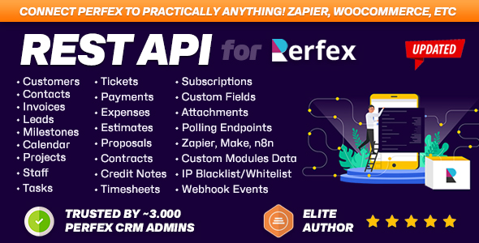

<p>
  <a href="https://themesic.com/product/rest-api-module-for-perfex-crm-connect-your-perfex-crm-with-third-party-applications/">
    
  </a>
</p>

# Perfex CRM REST API — Examples, Postman Collection & Code Snippets

🌐 **English** · [简体中文](README.zh-CN.md) · [Português (BR)](README.pt-BR.md) · [Tiếng Việt](README.vi.md) · [Français](README.fr.md) · [Deutsch](README.de.md)

> Ready-to-use **Postman collection**, **code snippets** (cURL, PHP, Python, JavaScript) and a resource
> **catalogue** for the [REST API module for Perfex CRM](https://themesic.com/product/rest-api-module-for-perfex-crm-connect-your-perfex-crm-with-third-party-applications/) —
> the fastest way to **connect Perfex CRM with third‑party applications**.

[](postman/perfex-rest-api.postman_collection.json)
[](LICENSE)
[](https://themesic.com/product/rest-api-module-for-perfex-crm-connect-your-perfex-crm-with-third-party-applications/)

The **Perfex CRM REST API** lets you read and write customers, leads, invoices, estimates, projects,
tasks and more over a clean HTTP/JSON interface — perfect for **CRM integration**, automation and custom
apps. This repository is the practical companion to the
**[REST API for Perfex CRM](https://themesic.com/product/rest-api-module-for-perfex-crm-connect-your-perfex-crm-with-third-party-applications/)**
module by **Themesic Interactive**: copy‑paste examples, an importable Postman collection, and a full
endpoint catalogue.

- 🧩 **Get the module:** https://themesic.com/product/rest-api-module-for-perfex-crm-connect-your-perfex-crm-with-third-party-applications/

- 📖 **API guide / live docs:** https://perfexcrm.themesic.com/apiguide/

---

## Contents

| Folder | What's inside |
| --- | --- |
| [`postman/`](postman/) | Importable Postman **collection** + **environment** (`{{base_url}}`, `{{authtoken}}`) |
| [`snippets/curl/`](snippets/curl/) | Copy‑paste `curl` commands for the most common calls |
| [`snippets/php/`](snippets/php/) | PHP (cURL) examples |
| [`snippets/python/`](snippets/python/) | Python (`requests`) examples |
| [`snippets/javascript/`](snippets/javascript/) | JavaScript / Node (`fetch`) examples |
| [`docs/`](docs/) | Authentication, pagination & filtering, errors & status codes |

---

## Quick start

Every request to the Perfex CRM REST API is authenticated with the **`Authtoken`** header. Create a token
in your Perfex admin under **API → API Management** (after activating the
[REST API module](https://themesic.com/product/rest-api-module-for-perfex-crm-connect-your-perfex-crm-with-third-party-applications/)),
then call the API at `https://yourdomain.com/api/...`:

```bash
curl -H "authtoken: YOUR_API_TOKEN" https://yourdomain.com/api/customers
```

That returns the list of customers as JSON. See [`docs/authentication.md`](docs/authentication.md) for
header vs. query‑parameter auth, and [`snippets/`](snippets/) for the same call in PHP, Python and JavaScript.

### Use the Postman collection

1. Open Postman → **Import** → drop in [`postman/perfex-rest-api.postman_collection.json`](postman/perfex-rest-api.postman_collection.json).
2. Import the environment [`postman/perfex-rest-api.postman_environment.json`](postman/perfex-rest-api.postman_environment.json).
3. Set `base_url` to `https://yourdomain.com/api` and `authtoken` to your token.
4. Pick any request and hit **Send**.

---

## Endpoint catalogue

All endpoints follow a RESTful convention: `GET` list, `GET /:id` single, `POST` create,
`PUT /:id` update, `DELETE /:id` delete — under the base path `https://yourdomain.com/api`.

| Resource | Base path | Typical operations |
| --- | --- | --- |
| Customers | `/api/customers` | list, get, create, update, delete |
| Contacts | `/api/contacts` | list, get, create, update, delete |
| Leads | `/api/leads` | list, get, create, update, delete |
| Invoices | `/api/invoices` | list, get, create, update, delete |
| Estimates | `/api/estimates` | list, get, create, update, delete |
| Credit Notes | `/api/credit_notes` | list, get, create, update |
| Payments | `/api/payments` | list, get, create |
| Proposals | `/api/proposals` | list, get, create, update, delete |
| Contracts | `/api/contracts` | list, get, create, update, delete |
| Projects | `/api/projects` | list, get, create, update, delete |
| Tasks | `/api/tasks` | list, get, create, update, delete |
| Milestones | `/api/milestones` | list, get, create, update, delete |
| Timesheets | `/api/timesheets` | list, get, create, update, delete |
| Subscriptions | `/api/subscriptions` | list, get, create, update |
| Items | `/api/items` | list, get, create, update, delete |
| Expenses | `/api/expenses` | list, get, create, update, delete |
| Staff | `/api/staffs` | list, get, create, update, delete |
| Calendar | `/api/calendar` | list, get, create, update, delete |
| Custom Fields | `/api/custom_fields` | list per related type |
| Common (lookups) | `/api/common` | countries, taxes, currencies, statuses … |

> The exact request fields per resource are documented in the official
> **[API guide](https://perfexcrm.themesic.com/apiguide/)**. The snippets here cover the most common flows.

---

## Popular integrations & use cases

The Perfex CRM REST API is commonly used to **connect Perfex CRM with third‑party applications** such as:

- **Zapier / Make / n8n** — no‑code automation (e.g. create a Perfex lead from a web form or Facebook Lead Ads).
- **Google Sheets / Power Automate** — sync customers, invoices or payments to spreadsheets and dashboards.
- **Webhooks** — push Perfex events (new invoice, new lead) to Slack, Discord or your own backend.
- **Custom apps & portals** — build a mobile app or customer portal on top of your Perfex data.
- **Accounting & e‑commerce** — sync invoices and items with external billing or shop platforms.

All of these are powered by the
[REST API for Perfex CRM](https://themesic.com/product/rest-api-module-for-perfex-crm-connect-your-perfex-crm-with-third-party-applications/) module.

---

## Authentication (summary)

| Method | How |
| --- | --- |
| Header (recommended) | `Authtoken: YOUR_API_TOKEN` |
| Query parameter | `?authtoken=YOUR_API_TOKEN` (handy for quick tests / webhooks) |

Tokens are created and scoped (per‑resource permissions) in **API → API Management**. Full details in
[`docs/authentication.md`](docs/authentication.md).

---

## FAQ

**Does Perfex CRM have a REST API?**
Yes. The [REST API for Perfex CRM](https://themesic.com/product/rest-api-module-for-perfex-crm-connect-your-perfex-crm-with-third-party-applications/)
module adds a full RESTful HTTP/JSON API for customers, leads, invoices, estimates, projects, tasks and more.

**How do I authenticate with the Perfex CRM API?**
Send your token in the `Authtoken` HTTP header (or as an `?authtoken=` query parameter). See
[`docs/authentication.md`](docs/authentication.md).

**What is the base URL of the Perfex CRM API?**
`https://yourdomain.com/api` — for example `https://yourdomain.com/api/customers`.

**Can I connect Perfex CRM to Zapier, Make or n8n?**
Yes — the REST API works with any automation platform that can send authenticated HTTP requests. See
[Popular integrations](#popular-integrations--use-cases).

**Is there a Postman collection for Perfex CRM?**
Yes — import [`postman/perfex-rest-api.postman_collection.json`](postman/perfex-rest-api.postman_collection.json)
and the bundled environment, set your `base_url` and `authtoken`, and start sending requests.

**How do I create an invoice via the Perfex CRM API?**
`POST https://yourdomain.com/api/invoices` with the invoice fields (and line items). See the Invoices
folder in the Postman collection.

---

## About / Support


This repository is an **examples companion** to the commercial module:

> **[REST API for Perfex CRM — connect your Perfex CRM with third‑party applications](https://themesic.com/product/rest-api-module-for-perfex-crm-connect-your-perfex-crm-with-third-party-applications/)**
> by [Themesic Interactive](https://themesic.com).

- 🛒 **Buy / learn more:** https://themesic.com/product/rest-api-module-for-perfex-crm-connect-your-perfex-crm-with-third-party-applications/
- 📖 **Documentation:** https://perfexcrm.themesic.com/apiguide/
- 💬 **Support:** via the item's support channel on Themesic Interactive.

Contributions of additional examples are welcome — see [`CONTRIBUTING.md`](CONTRIBUTING.md).

## License

Example code in this repository is released under the [MIT License](LICENSE). "Perfex" is a trademark of
its respective owner; the REST API module is a commercial product by Themesic Interactive.
